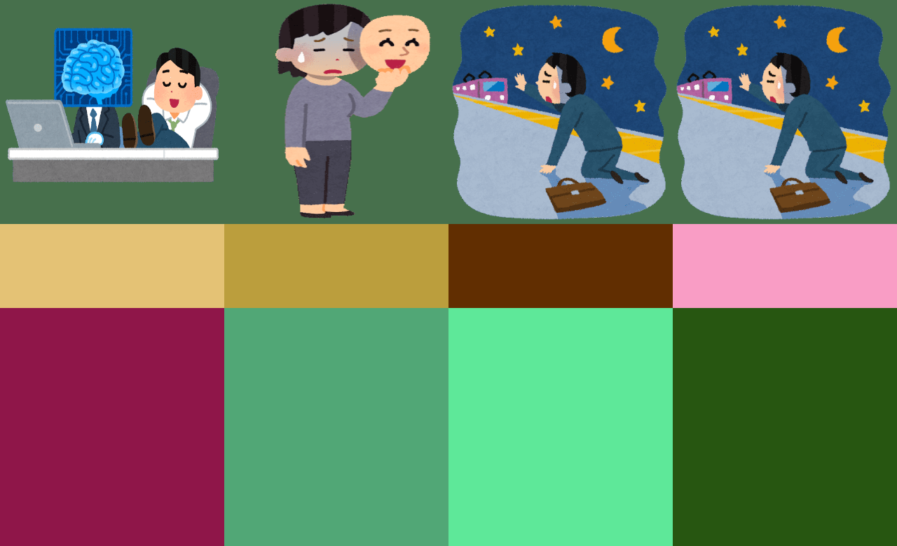

# yokonagashi-video-maker

# Code As Vide (CAV)

## usage
### Make Project File
```commandline
# Make project direcotry 
mkdir projects/projectX

# Edit Json File
vim projects/projectX/setting.json

# Edit Descriptions
vim projects/projectX
```

### example
#### setting.json
```commandline
{
  "description_image": {
    "height": 780,
    "width": 320,
    "layers": {
      "image_layer": {
        "description_type": "image",
        "height": [
          0,
          320
        ],
        "width": [
          0,
          320
        ]
      },
      "title_layer": {
        "description_type": "string",
        "height": [
          320,
          440
        ],
        "width": [
          0,
          320
        ]
      },
      "description_layer": {
        "description_type": "string",
        "height": [
          440,
          780
        ],
        "width": [
          0,
          320
        ]
      }
    }
  },
  "margin_setting": 0
}
```

#### description.tsv
```commandline
image_layer	title_layer	description_layer
tests/mock-imgs/ai.png	AI	I want AI to change my job...
tests/mock-imgs/aisowarai.png	Fake Smile	Endless Work...
tests/mock-imgs/shuden.png	Last Train	Stay overnight at the office...
tests/mock-imgs/shuden.png	Last Train	Stay overnight at the office...
```


